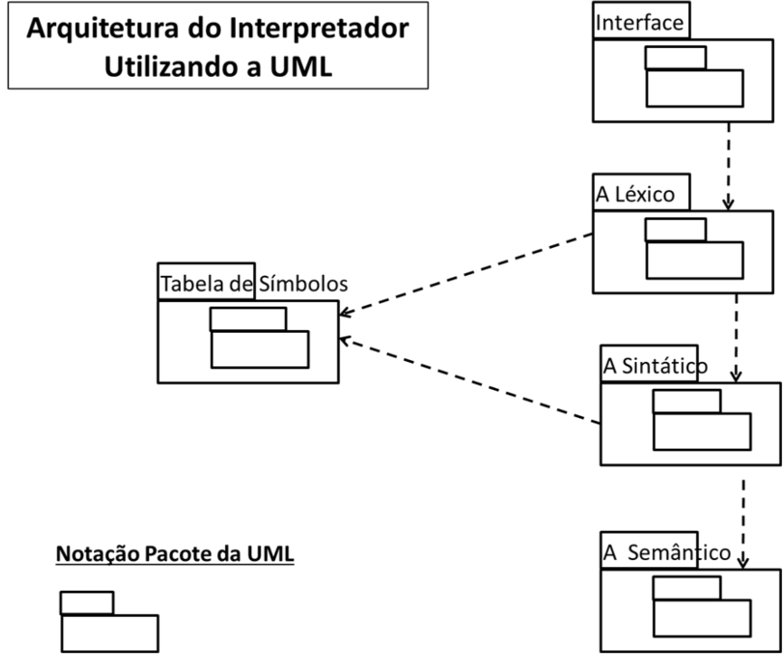
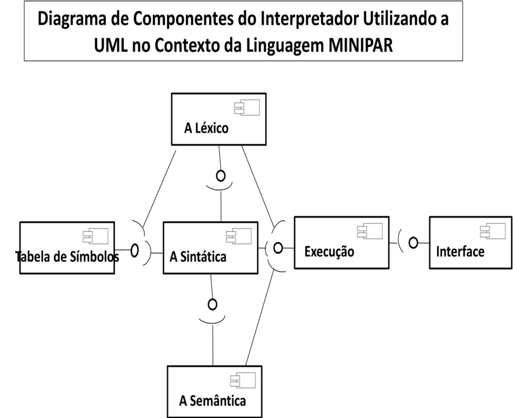
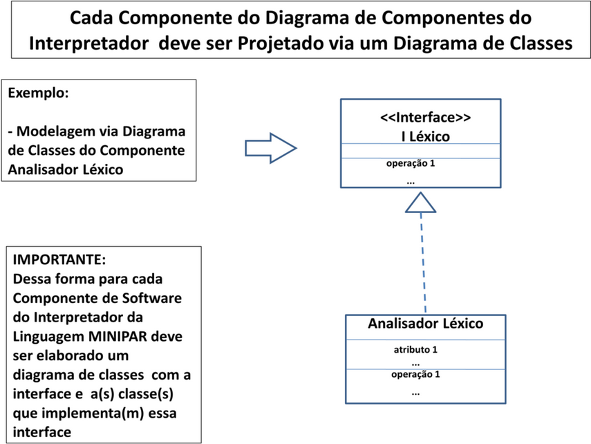
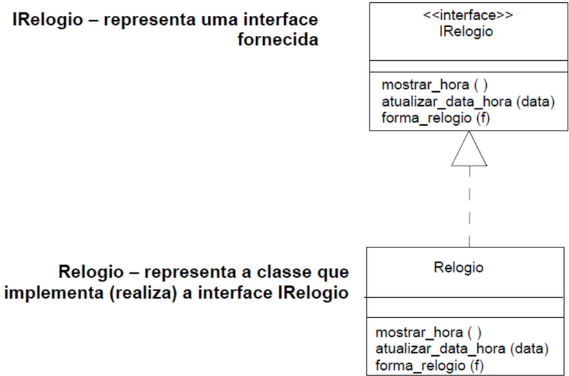

# Tema 2

“Desenvolvimento de um Interpretador para a Linguagem MiniPar 2025.1 Orientada a Objetos” (Analisadores Léxico, Sintático Descendente - Arvore Sintática - Tabela de Símbolos e Semântico) respeitando a Gramática da Linguagem Orientada a Objetos do Minipar

Projeto do Interpretador MiniPar baseado no Reuso de Software utilizando Componentes de Software

## 1. ENUNCIADO:
Desenvolvimento de um Interpretador para a Linguagem MiniPar Orientada a Objetos utilizando Componentes de Software” (Analisadores Léxico, Sintático Semântico) e Execução do interpretador segundo a Gramática da Linguagem Minipar 2025.1 Orientada a Objetos.

Implementar o Interpretador da linguagem MiniPar 2025.1 em Java, Python ou C++. Programar de forma Orientada a Objetos.

A modelagem do interpretador para a linguagem MiniPar 2025.1 deve ser realizada utilizando técnicas de Engenharia de Software tais como Componentes de Software. A arquitetura do interpretador será realizada utilizando Componentes de Software, para os Analisadores (Léxico – Sintático - Semântico) e a Tabela de Símbolos será representados via componentes de software. 

Para a modelagem dos componentes de software (analisador léxico, analisador sintático, analisador semântico e tabela de símbolos) deve ser utilizada a UML (linguagem de modelagem de sistemas orientados a objetos).

## 2. A LINGUAGEM MINIPAR 2025.1

Programa_MiniPar: Programa de instruções de execução sequencial e paralela.

### Características:
Execução de PAR precisa da utilização de Threads para implementar o paralelismo. Considerar a execução de Theads como Processos independentes sem compartilhar informações. 

> Comunicação somente via mensagem.  
> Canal de Comunicação (implementado com sockets em Java ou Phyton) 

O Send e Receive de dados via un canal de comunicação que pode ser implementado via sockets em Java ou Phyton.

Send (envio de dados via um canal de comunicação - socket a outro computador)
Receive (recepção de dados de outro computador via um canal de comunicação - socket)
Os testes podem ser realizados no mesmo computador na forma localhost.

### Blocos de Instruções SEQ e PAR:

SEQ - Execução sequencial (tradicional) de um conjunto de instruções 
PAR - Execução paralela (implementada com Threads) de um conjunto de instruções

### Tipos de Variáveis:
* Bool – o mesmo do Phyton
* Int - o mesmo do Phyton
* String - o mesmo do Phyton
* c_channel – (comunication channel) canal de comunicação entre dois computadores

### Entrada e Saída:
Input (entrada do Teclado) – a mesma do Phyton
Output (na tela) – a mesma do Phyton

> Uso de Comentários #  
> Com declaração e uso de Funções

> IMPORTANTE: Concluir as Produções e Acrescentar novas Produções à Gramática BNF considerando os Programas de Teste

### Produções

```
programa_minipar → bloco_stmt  
bloco _stmt → bloco_SEQ | bloco_PAR  
bloco_SEQ → SEQ stmts  
bloco_PAR → PAR stmts  
tipos_var → ...  
stmts → atribuição | if ( bool ) stmt | if ( bool ) stmt else stmt | while ( bool ) stmt  

// a produção <stmts> deve ser atualizada para considerar a instanciação de
// objetos e a chamada de métodos, outras instruções como do e for podem ser
// consideradas

atribuição → id = expr  
expr → ...  
c_channel → chan id id_comp1 id_comp2  
...  
```

> No contexto da Orientação a Objetos, considerar as seguintes produções que devem ser concluídas pelo aluno.

BNF – Orientação a Objetos, exemplo: sintaxe Java o aluno pode considerar e seguir essas produções ou utilizar outra sintaxe (a ser definida pelo aluno), por exemplo, em Python, desta forma será possível considerar a abordagem da programação orientada a objetos para outra linguagem de programação:


```
<programa> → { <classe> }
<classe> → "class" <identificador> [ "extends" <identificador> ] "{" { <declaracao_metodo> } "}"

// deve ser acrescentado um não terminal para considerar <declaração de atributos> na produção <classe>

<declaracao_metodo> → <tipo_retorno> <identificador> "(" ")" "{" { <comando>
} "}"
<tipo_retorno> → "void" | "int" | "float" | "String" | <identificador> // Pode representar tipo personalizado

<comando> → <instanciacao> | <chamada_metodo> | <print_comando>

<instanciacao> → <identificador> <identificador> "=" "new" <identificador> "(" ")" ";"

<chamada_metodo> → <identificador> "." <identificador> "(" ")" ";"

<print_comando> → "print" "(" <texto> ")" ";"

<identificador> → <letra> { <letra> | <digito> }

<texto> → '"' { <caractere> } '"'

<letra> → "A" | ... | "Z" | "a" | ... | "z"
```

#### Importante:
Essas regras representam a Orientação a Objetos em Java. Se os alunos desejarem outra sintaxe da linguagem por exemplo python, pode ser, então os alunos (as) devem representar essas produções da sintaxe java para as produções equivalentes (considerando a Orientação a Objetos) em syntaxe python.

* Observação 1: programa_minipar – Representa um programa a ser executado pelo Interpretador MiniPar
* Observação 2: Deve se considerar precedência nos operadores aritméticos +, -,* e / no * momento de completar a produção expr
* Observação 3: Deve se utilizar funções e recursão.
* Observação 4: Precisam concluir a Gramática da Linguagem MINIPAR para que cumpra com a especificação de todos os programas de testes.
* Observação 5: Realizar Tratamento de Erros na Implementação do interpretador MiniPar

## 3. Programas de Teste (na linguagem MINIPAR 2025.1)

- Lembrar de utilizar comentários via #
- Implementar utilizando classes e objetos da Linguagem MiniPar Orientada a Objetos

### Programa de Teste 1:

```
programa-minipar
# Programa cliente servidor de uma calculadora aritmética simples
# O cliente (computador_1) solicita a execução de uma operação aritmética e o servidor (computador_2) realiza o cálculo retornando o resultado para o cliente

c_channel calculadora computador_1 computador_2
# declaração do canal de comunicação calculadora associada a dois computadores (computador_1 e computador_2)

SEQ
# Depois do SEQ todas as seguintes instruções indentadas serão executadas de forma sequencial
# Apresentar na tela via print as opções da calculadora +, -, *, /

# Ler a operação aritmética desejada via sys.stdin.readline()
# Ler o operando 1 (valor) e operando 2 (valor) via sys.stdin.readline()

calculadora.send (operação, valor1, valor2, resultado)
# Computador cliente (computador_1)
# Imprime o resultado via print

---- Execução: Servidor (computador 2)
# Computador servidor
calculadora.receive (operação, valor1, valor2, resultado)
# Computador 2 recebe a solicitação do cliente (computador 1) e executa o cálculo e retorna o resultado ao cliente (computador 1)
```

Execução: Testar com localhost para o computador 2 (Servidor)

### Programa de Teste 2:

```
programa-minipar
PAR
# Execução paralela (implementação via uso de threads em Java ou Phyton)
# depois do PAR todas as seguintes instruções indentadas serão executadas de forma “paralela“

# A seguir colocar o Código do Cálculo do Fatorial de um número (thread 1)
... linhas de código do Cálculo do Fatorial de um número na linguagem MiniPar

# A seguir colocar o Código do Cálculo da Série de Fibonacci (thread 2)
... linhas de código do Cálculo da Série de Fibonacci na linguagem MiniPar
```

Execução: Thread 1 (Cálculo do Fatorial) e thread 2 (Cálculo da Série de Fibonacci) são executadas de forma simultânea (“paralela”) no mesmo computador.

> [!NOTE]  
> Dica: http://www.dicas-l.com.br/arquivo/programando_socket_em_c++_sem_segredo.php

### Programa de Teste 3:

Implementar um programa na linguagem minipar para o código seguinte (exemplo em Python) da implementação de um neurônio utilizando Classes e Objetos

```python
class Neuronio:
    def __init__(self, input_val, output_desejado, peso_inicial=0.5, peso_bias_inicial=0.5, taxa_aprendizado=0.01):
        self.input_val = input_val
        self.output_desejado = output_desejado
        self.peso = peso_inicial
        self.bias = 1
        self.peso_bias = peso_bias_inicial
        self.taxa_aprendizado = taxa_aprendizado
        self.erro = float('inf')
        self.iteracao = 0

def ativacao(self, soma):
    return 1 if soma >= 0 else 0

def treinar(self):
    print(f"Entrada: {self.input_val} | Saída desejada: {self.output_desejado}")
    
    while self.erro != 0:
        self.iteracao += 1

        print(f"\n#### Iteração: {self.iteracao}")
        print(f"Peso: {self.peso:.4f}")

        soma = (self.input_val * self.peso) + (self.bias * self.peso_bias)
        saida = self.ativacao(soma)
        print(f"Saída: {saida}")

        self.erro = self.output_desejado - saida
        print(f"Erro: {self.erro}")

        if self.erro != 0:
            self.peso += self.taxa_aprendizado * self.input_val * self.erro
            print(f"Peso do bias: {self.peso_bias:.4f}")
            self.peso_bias += self.taxa_aprendizado * self.bias * self.erro

    print("\n✅ Parabéns! O neurônio aprendeu.")
    print(f"Valor desejado: {self.output_desejado}")

# Exemplo de uso
neuronio = Neuronio(input_val=1, output_desejado=0)
neuronio.treinar()
```


<details>
<summary>Execução:</summary>

```
Entrada: 1 | Saída desejada: 0
#### Iteração: 1
Peso: 0.5000
Saída: 1
Erro: -1
Peso do bias: 0.5000

#### Iteração: 2
Peso: 0.4900
Saída: 1
Erro: -1
Peso do bias: 0.4900

#### Iteração: 3
Peso: 0.4800
Saída: 1
Erro: -1
Peso do bias: 0.4800

#### Iteração: 4
Peso: 0.4700
Saída: 1
Erro: -1
Peso do bias: 0.4700

...
#### Iteração: 49
Peso: 0.0200
Saída: 1
Erro: -1
Peso do bias: 0.0200

#### Iteração: 50
Peso: 0.0100
Saída: 1
Erro: -1

Peso do bias: 0.0100
#### Iteração: 51
Peso: -0.0000
Saída: 0
Erro: 0
Parabéns! O neurônio aprendeu.
Valor desejado: 0
...Program finished with exit code 0
Press ENTER to exit console.
```

</details>

### Programa de Teste 4:

Implementar um programa na linguagem Minipar 2025.1 para o código seguinte (exemplo em Python) da implementação de um a Rede Neural para aprender a função XOR com uma camada oculta de #3 neurônios e uma saída. Utilizando funções.

```python
# Este código cria uma rede neural com uma camada oculta de três neurônios
# e uma camada de saída com um neurônio, utilizando a função de ativação sigmóide.
# Ele treina a rede para aprender a função XOR usando feedforward e backpropagation.
# Todos os cálculos são realizados manualmente, sem o uso de bibliotecas externas.

import random
import math

# Funções auxiliares
def sigmoid(x):
    return 1 / (1 + math.exp(-x))

def sigmoid_derivative(x):
    return x * (1 - x)

class Neuronio:
    def __init__(self, num_inputs):
        self.pesos = [random.random() for _ in range(num_inputs)]
        self.bias = random.random()
        self.saida = 0

    def feedforward(self, entradas):
        soma = sum([entradas[i] * self.pesos[i] for i in range(len(entradas))]) + self.bias
        self.saida = sigmoid(soma)
        return self.saida

    def calcular_derivada(self):
        return sigmoid_derivative(self.saida)

class RedeNeural:
    def __init__(self, taxa_aprendizado=0.2):
        self.taxa_aprendizado = taxa_aprendizado
        self.camada_oculta = [Neuronio(2) for _ in range(3)]
        self.neuronio_saida = Neuronio(3)

    def feedforward(self, entradas):
        saidas_ocultas = [neuronio.feedforward(entradas) for neuronio in self.camada_oculta]
        saida_final = self.neuronio_saida.feedforward(saidas_ocultas)
        return saidas_ocultas, saida_final

    def backpropagation(self, entradas, saida_desejada, saidas_ocultas, saida_final):
        erro = saida_desejada - saida_final
        delta_saida = erro * self.neuronio_saida.calcular_derivada()

        # Atualiza pesos da camada de saída
        for i in range(len(self.neuronio_saida.pesos)):
            self.neuronio_saida.pesos[i] += saidas_ocultas[i] * delta_saida * self.taxa_aprendizado
            self.neuronio_saida.bias += delta_saida * self.taxa_aprendizado

        # Atualiza pesos da camada oculta
        for i, neuronio in enumerate(self.camada_oculta):
            delta_oculto = delta_saida * self.neuronio_saida.pesos[i] * neuronio.calcular_derivada()

            for j in range(len(neuronio.pesos)):
                neuronio.pesos[j] += entradas[j] * delta_oculto * self.taxa_aprendizado

            neuronio.bias += delta_oculto * self.taxa_aprendizado

        def treinar(self, entradas, saidas_desejadas, epocas=20000):
            for _ in range(epocas):
                for entrada, saida_desejada in zip(entradas, saidas_desejadas):
                    saidas_ocultas, saida_final = self.feedforward(entrada)
                    self.backpropagation(entrada, saida_desejada, saidas_ocultas, saida_final)

    def testar(self, entradas):
        for entrada in entradas:
            _, saida_final = self.feedforward(entrada)
            print(f"Input: {entrada}, Predicted Output: {saida_final:.4f}")

# Dados XOR
entradas = [[0, 0], [0, 1], [1, 0], [1, 1]]
saidas_desejadas = [0, 1, 1, 0]

# Execução
rede = RedeNeural()
rede.treinar(entradas, saidas_desejadas)
rede.testar(entradas)
```


<details open>

<summary>Execução:</summary>

```
Input: [0, 0], Predicted Output: 0.0089
Input: [0, 1], Predicted Output: 0.9769
Input: [1, 0], Predicted Output: 0.9758
Input: [1, 1], Predicted Output: 0.0291

...Program finished with exit code 0
Press ENTER to exit console.
```

</details>

### Programa de Teste 5:

Implementar um programa na linguagem Minipar 2025.1 para o código seguinte (exemplo em Python) da implementação de um Sistema de Recomendação, no contexto de e-commerce levando em conta o histórico de compras do usuário, utilizando Redes Neurais e implementado em Python.

#### Estrutura da Rede Neural do Programa

1. Entrada:

Cada produto é representado por um número:

* 1 se o usuário comprou
* 0 se não comprou

Isso forma um vetor binário chamado histórico codificado.

2. Camada Oculta:  
Tem 10 neurônios.  
Cada neurônio recebe todos os valores da entrada, multiplica por pesos e soma com um bias.  

A soma passa por uma função de ativação ReLU:  
```python
relu(x) = max(0, x)
```

Isso ajuda a introduzir não-linearidade, ignorando valores negativos.

3. Camada de Saída:  
Tem o mesmo número de neurônios que a entrada (um para cada produto).  
Cada neurônio recebe os valores da camada oculta, aplica pesos e bias, e passa pela função sigmóide:
```python
sigmoid(x) = 1 / (1 + e^(-x))
```
A saída será um valor entre 0 e 1, que representa a probabilidade de recomendação.

4. Propagação (Forward Propagation):  
Esse é o processo de passar os dados pela rede:  
* Multiplica os dados de entrada pelos pesos da camada oculta.
* Soma com os bias e aplica ReLU.
* Usa os resultados da camada oculta como entrada para a camada de saída.
* Aplica a função sigmóide para obter as probabilidades finais.

```python
import math

class Produto:
    def __init__(self, nome):
        self.nome = nome

class Categoria:
    def __init__(self, nome, produtos):
        self.nome = nome
        self.produtos = [Produto(p) for p in produtos]

class Usuario:
    def __init__(self, historico_compras):
        self.historico_compras = historico_compras

def codificar_historico(self, todos_produtos):
    codificacao = [1 if produto in self.historico_compras else 0 for produto in todos_produtos]
    return codificacao

class RedeNeural:
    def __init__(self, input_size, hidden_size, output_size):
        self.W1 = [[0.5 for _ in range(hidden_size)] for _ in range(input_size)]
        self.b1 = [0.5] * hidden_size
        self.W2 = [[0.5 for _ in range(output_size)] for _ in range(hidden_size)]
        self.b2 = [0.5] * output_size

    def relu(self, x):
        return [max(0, i) for i in x]

    def sigmoid(self, x):
        return [1 / (1 + math.exp(-i)) for i in x]

    def forward(self, X):
        Z1 = [sum(X[j] * self.W1[j][i] for j in range(len(X))) + self.b1[i] for i in range(len(self.b1))]
        A1 = self.relu(Z1)
        Z2 = [sum(A1[j] * self.W2[j][i] for j in range(len(A1))) + self.b2[i] for i in range(len(self.b2))]
        A2 = self.sigmoid(Z2)
        return A2

class Recomendador:
    def __init__(self, usuario, categorias):
        self.usuario = usuario
        self.categorias = categorias
        self.todos_produtos = [produto.nome for categoria in categorias for produto in categoria.produtos]

    def recomendar(self):
        entrada_codificada = self.usuario.codificar_historico(self.todos_produtos)
        input_size = len(entrada_codificada)
        hidden_size = 10
        output_size = len(entrada_codificada)

        rede = RedeNeural(input_size, hidden_size, output_size)
        saida = rede.forward(entrada_codificada)

        recomendacoes = [
            self.todos_produtos[i]
            for i in range(len(saida))
            if saida[i] > 0.5 and self.todos_produtos[i] not in self.usuario.historico_compras
        ]

        return recomendacoes

# ---------- Execução ----------

# Dados de entrada
categorias = [
    Categoria("Eletrônicos", ["Smartphone", "Laptop", "Tablet", "Fones de ouvido"]),
    Categoria("Roupas", ["Camisa", "Jeans", "Jaqueta", "Sapatos"]),
    Categoria("Eletrodomésticos", ["Geladeira", "Micro-ondas", "Máquina de lavar", "Ar
    condicionado"]),
    Categoria("Livros", ["Ficção", "Não-ficção", "Ficção científica", "Fantasia"])
]

usuario = Usuario(["Smartphone", "Jeans", "Micro-ondas", "Ficção"])
recomendador = Recomendador(usuario, categorias)
recomendacoes = recomendador.recomendar()

# Exibir recomendações
print("Produtos recomendados para você:")
for produto in recomendacoes:
    print(produto)
```


<details open>
<summary>Execução:</summary>

```
Produtos recomendados para você:
Laptop
Tablet
Fones de ouvido
Camisa
Jaqueta
Sapatos
Geladeira
Máquina de lavar
Ar condicionado
Não-ficção
Ficção científica
Fantasia
...Program finished with exit code 0
Press ENTER to exit console.
```

</details>

### Programa de Teste 6:

Implementar um programa na linguagem Minipar 2025.1 para o código seguinte (exemplo em Python) da implementação do metodo de ordenação QuickSort

```python
class Quicksort:
    def __init__(self, array):
        self.array = array

    def ordenar(self):
        return self._quicksort(self.array)

    def _quicksort(self, array):
        if len(array) <= 1:
            return array
        else:
            pivot = array[0]
            menores = [x for x in array[1:] if x <= pivot]
            maiores = [x for x in array[1:] if x > pivot]
            return self._quicksort(menores) + [pivot] + self._quicksort(maiores)

class InterfaceOrdenacao:
    def iniciar(self):
        print("==== Ordenação com Quicksort ====")
        print("Insira os elementos do vetor separados por espaço:")
        try:
            entrada = input().strip()
            array = list(map(int, entrada.split()))
            print(f"Vetor original: {array}")

            algoritmo = Quicksort(array)
            vetor_ordenado = algoritmo.ordenar()
            print(f"Vetor ordenado: {vetor_ordenado}")
        except ValueError:
            print("Por favor, insira apenas números separados por espaço.")
            self.iniciar() # Reinicia a interface em caso de erro

# Executa o programa
if __name__ == "__main__":
    interface = InterfaceOrdenacao()
    interface.iniciar()
```

<details open>
<summary>Execução:</summary>

```
==== Ordenação com Quicksort ====
Insira os elementos do vetor separados por espaço:
10 -3 -40 80 70 -100
Vetor original: [10, -3, -40, 80, 70, -100]
Vetor ordenado: [-100, -40, -3, 10, 70, 80]
...Program finished with exit code 0
Press ENTER to exit console.
```

</details>

## 4. Entrega do Tema 2

1. Colocar o pseudocódigo do Analisador Léxico (Lexer).
2. Colocar o pseudocódigo do Analisador Sintático (Parser).
3. Colocar o pseudocódigo do Analisador Semântico e o Tratamento de Erros, também deve permitir comentários via: #
4. Colocar o pseudocódigo da Tabela de Símbolos.
5. Interface do Interpretador da Linguagem MINIPAR  
    <details>
    
    <summary>Exemplo da interface:</summary>

    

    </details>
6. Product Backlog do Interpretador da Linguagem MINIPAR
7. Sprints BackLog do Interpretador da Linguagem MINIPAR
8. Diagrama de Casos de Uso segundo a notação da UML
9. Arquitetura utilizando Componentes de Software segundo a notação da
UML
10. Modelagem dos Componentes de Software via Diagrama de Classes
segundo a notação da UML
11. Testes de Software de Integração do Compilador da Linguagem MINIPAR
12. Testes dos Programas de Exemplo na Linguagem MINIPAR
13. Implementação
    * 13.a Tecnologias Utilizadas (linguagem utilizada - qual foi o ambiente de desenvolvimento utilizado) na Implementação do Compilador da Linguagem Minipar.
    O código do Interpretador Minipar implementado deve também conter comentários explicativos.
    * 13.b Mostrar o passo a passo das telas da execução dos programas de Testes na Linguagem MINIPAR.
14. Colocar o código fonte, os programas de testes e o relatório do Compilador da Linguagem Minipar utilizando Componentes de Software no Github.
15. Colocar o link do código fonte no Github da Linguagem Minipar utilizando Componentes no relatório do Compilador da Linguagem MINIPAR.

## Apêncice 1

<div align="center">
Modelagem do Compilador para a Linguagem MINIPAR<br>
Orientada a Objetos utilizando Componentes de Software
</div>

#### Tela do Interpretador da Linguagem MINIPAR


-------------------------------

<div align="center">
MODELAGEM DO INTERPRETADOR DA LINGUAGEM MINIPAR
</div>







## Apêncice 2

### Exemplo de modelagem de um Componente
Representar um relógio através de um componente de software usando a notação UML.


As operações associadas a interface fornecida `IRelogio` do componente `Relogio` são:
- `mostrar_hora()`: Exibe a hora atual.
- `atualizar_data_hora(data)`: Atualiza a data e hora do relógio.
- `forma_relogio(f)`: Define o formato do relógio, onde `f` pode ser 1 (digital) ou 0 (analógico).

### Modelagem do Componente Relogio (via Diagrama de Classes UML)



A classe Relogio deve fornecer a implementação de cada operação (`mostrar_hora ()` – `atualizar_data_hora (data)` – `forma_relogio (f)`) da Interface IRelogio.

### Exemplo de Implementação do Componente Relógio

<details open>

<summary>Implementação em Java:</summary>

```java
abstract class RelogioAbstrato {
    // Métodos abstratos: devem ser implementados pelas subclasses
    public abstract void atualizar_data_hora(String data);

    public abstract void forma_relogio(String f);

    public abstract void mostrar_hora();
}

class Relogio extends RelogioAbstrato {
    private String dataHora;
    private String formato;

    @Override
    public void mostrar_hora() {
        System.out.println("Hora atual: " + dataHora + " (Formato: " + formato + ")");
    }

    @Override
    public void atualizar_data_hora(String data) {
        this.dataHora = data;
        System.out.println("Data e hora atualizadas para: " + dataHora);
    }

    @Override
    public void forma_relogio(String f) {
        this.formato = f;
        System.out.println("Formato do relógio definido para: " + formato);
    }
}

public class Aplicacao {
    public static void main(String[] args) {
        // Usando a classe abstrata como tipo de referência
        RelogioAbstrato meuRelogio = new Relogio();

        // Atualiza a data e hora
        meuRelogio.atualizar_data_hora("14/08/2025 08:00");

        // Define o formato do relógio
        meuRelogio.forma_relogio("24h");

        // Mostra a hora atual
        meuRelogio.mostrar_hora();
    }
}
```

</details>

#### Execução (Saída):
```
Data e hora atualizadas para: 14/08/2025 08:00
Formato do relógio definido para: 24h
Hora atual: 14/08/2025 08:00 (Formato: 24h)

...Program finished with exit code 0
Press ENTER to exit console.
```